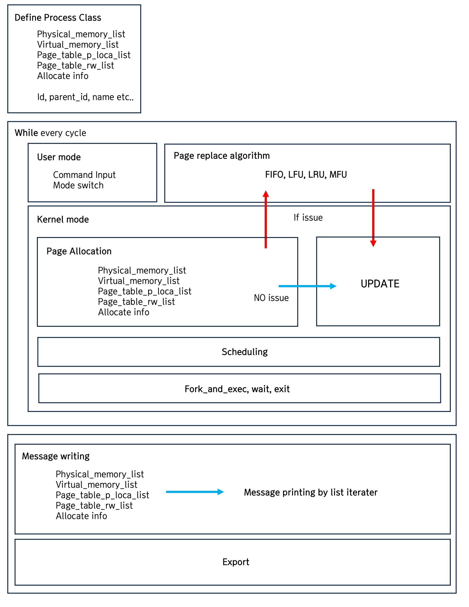
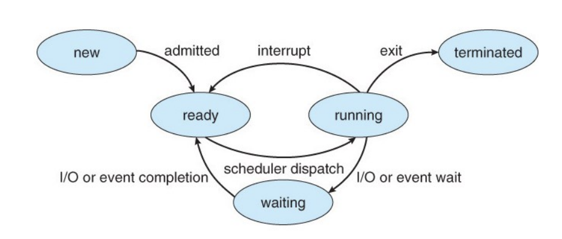
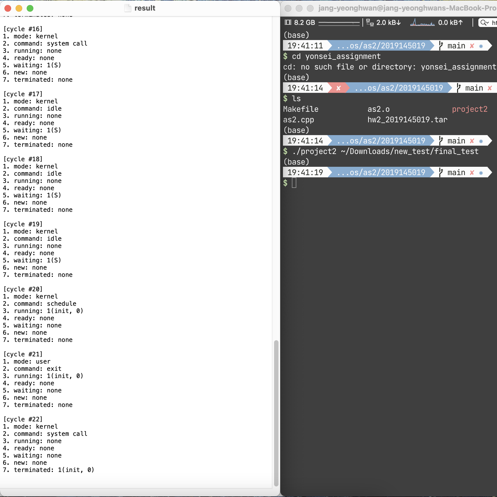

# kernel-simulator

## Process Overview
<p align="center">
  
</p>


## Virtual Program Commands
- System call: **memory_allocate, memory_release, fork_and_exec, wait, exit**
  - Assume the parent process executes and waits for the execution time of fork_and_exec.
  - Sleep from the second assignment is not implemented in this assignment.
- User code commands: **memory_read, memory_write**

<p align="center">
  
</p>

## Documatation

**System Call**
- [memory_allocate](docs/memory_allocate.md)
- [memory_release](docs/memory_release.md)
- [for_and_exec](docs/fork_and_exec.md)
- [wait](docs/wait.md)
- [exit](docs/exit.md)

**User code commands**
- [memeory_write](docs/memory_write.md)
- [memory_read](docs/memory_read.md)

## Process details

### Input command & mode switch
In the case of the user mode, the command of the received current process is imported one line. Memory_allocate, memory_release, memory_read, memory_write, fork_and_exec, wait, and exit are separated into strings, and the argument is divided by substr slicing.  

Operations moving on to a system call or fault are reflected in the next cycle by switching kernel mode. The operations following in the kernel mode are assigned cycles, respectively, and the number of cycles is designated to perform a predetermined operation.

```cpp
// user case
if (mode == "user")
{
    // not running
    if (run_remain_cycle == 0)
    {
        list<pair<int, queue<string> *>>::iterator iter2;
        queue<string> *user_command_queue;
        for (iter2 = pid_command_list.begin();
              iter2 != pid_command_list.end(); iter2++)
        {
            int pid = iter2->first;
            user_command_queue = iter2->second;

            if (process_now->id == pid)
            {
                command = (*user_command_queue).front();
                (*user_command_queue).pop();
                break;
            }
        }

        string command_sliced = command.substr(0, 1);

        string command_memory;
        // cout << command;

        if (command_sliced == "m") {
            command_memory = command.substr(7, 3);
            // answer += command_memory;
            // break;

            // allocate [systeml_call]
            if (command_memory == "all")
            {
                memory_allocate_num = stoi(command.substr(16));
                allocate_cycle = 2;
                mode = "kernel";
            }
            // release [system_call]
            else if (command_memory == "rel")
            {
                memory_release_num = stoi(command.substr(15));
                release_cycle = 2;

                mode = "kernel";
            }
        }
    }
}
```

## Fixed actions & Page related command actions

### memory_allocate : flow 
Memory_allocate proceeded in the following order.
Among the page replacement algorithms, only fifo was partially implemented.
1. start_index finding
2. If issue:
    - Page fault handler
    - By page replace algorithm
3. page_allocation
4. frame_allocation
5. page_table update
    - page_location
    - page_RorW_info

### memory_write
Other commands can be implemented according to the specification, but in particular, memory_write is a command that requires consideration of the page replacement algorithm.  
Like memory_allocate, the frame, page, and page_table information were updated.

### scheduling
In the cycle of finishing the kernel mode operation, the current process must be scheduled, which was implemented by changing the state variable of the process from Ready to Running. It was simplified by implementing the schedule() function inside the class

### Kernel : fork_and_exec
In the case of a command in which mode switching occurs in user mode, fork_cycle, sleep_cycle, and wait_cycle are assigned. In this way of reducing the command count, it is designed to check the command count every time it rotates the while loop and perform a predetermined operation. In the case of Fork_and_exec, a new forked_process was created and a command list corresponding to the forked_process was read from the user_command list.

## Snapshot
<p align="center">
  
</p>

## Environment
OS: Mac Ventura  
Language: C++ 17